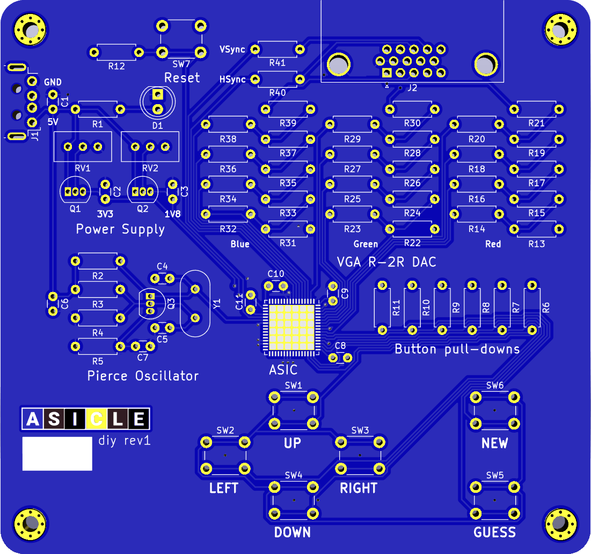
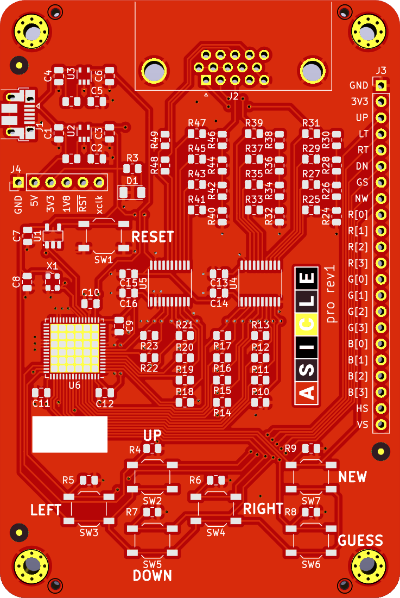

# Asicle boards

Contains two PCB designs for the Wordle clone on ASIC, [Asicle](https://github.com/htfab/asicle).

Asicle DIY uses only discrete transistors and passives for the supporting circuitry, with through-hole components for everything except the ASIC.

Asicle PRO uses standard commercial chips for voltage regulation, clock generation and VGA buffering for better reliability, and is designed with surface-mount components.

